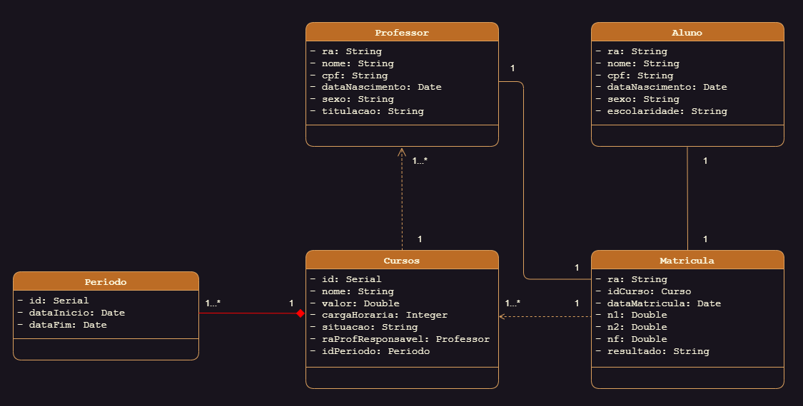

# 2024/2 - Desafio 1 - BACK-END DEVELOPER

## Descrição

Atividade avaliativa para a disciplina Back-End Developer - Conhecendo Banco de Dados e Integrando Aplicações, do Curso de Análise e Desenvolvimento de Sistemas, do Centro Universitário de Valença.

## Status do Projeto

> Status: Concluido.

## Objetivo

Este projeto tem como objetivo principal a implementação de um diagrama de classes e banco de dados relacional de um cenário fictício, utilizando a linguagem SQL e o sistema gerenciador de banco de dados PostgreSQL.

### Cenário fictício:

Um centro universitário está abrindo uma nova área de negócios, ofertando cursos rápidos, como formação complementar e especialização. A sua equipe foi convidada a desenvolver um sistema para que atenda a essa nova área de negócios da instituição.

## Tecnologias utilizadas

- **SQL:** Linguagem de consulta estruturada para manipulação de dados.
- **PostgreSQL:** Sistema gerenciador de banco de dados relacional open-source.
- **UML:** Linguagem de modelagem unificada para visualização e especificação do sistema.

## Instruções de Uso:

Para utilizar este banco de dados, siga os seguintes passos:

1. **Instale o PostgreSQL:** Baixe e instale o PostgreSQL em seu sistema operacional.
2. **Crie um novo banco de dados:** Utilize o pgAdmin ou o comando `CREATE DATABASE nome_do_banco` no terminal.
3. **Importe o script SQL:** Execute o script SQL (<a href="Banco01_CREATE_ALTER.sql">Banco01</a>, <a href="Banco02_INSERT.sql">Banco02</a> e <a href="Banco03_SELECT.sql">Banco03</a>) com as instruções de criação das tabelas e inserção de dados.

## Diagrama de Classes

O seguinte diagrama de classes apresenta a estrutura do banco de dados, definindo as entidades, seus atributos e relacionamentos.

## Apresentação

O vídeo apresenta o diagrama de classes do cenário e demonstra a criação e a estrutura do banco de dados no pgAdmin, ferramenta gráfica para administração do PostgreSQL.

## Colaboradores

Este projeto foi desenvolvido graças aos colaboradores:

